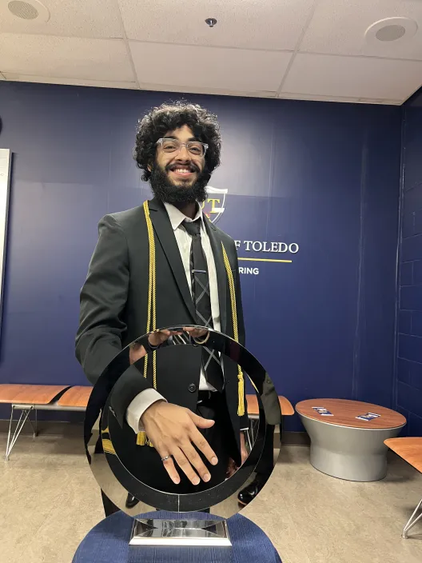

# Professional Portfolio: Sai Grover

## About Me
Welcome to my professional portfolio! I am a Computer Science and Engineering graduate from The University of Toledo, passionate about software automation and innovation.

## Education
**The University of Toledo, Toledo, Ohio**
- Bachelor of Science: Computer Science and Engineering
- Grade Point Average: 3.5

## Work Experience
### Proterra, Greenville, South Carolina (May 2022 - September 2022)
**Diagnostic Engineering Intern**
- Automated service work using Selenium library and Salesforce API, boosting productivity by 60%.
- Designed and assembled 3 electrical harnesses for specific CAN signals within EV buses.
- Optimized ten SQL databases, resulting in a 20% increase in search speed for a diagnostic software tool.

### Proterra, Greenville, South Carolina (January 2022 - May 2022)
**Validation Engineering Intern**
- Automated software for test execution and data collection, saving the equivalent of three employees' work.
- Implemented over 100 Smartsheet workflows for design, assembly, execution, and safety checks.
- Conducted validation and data analysis by sampling over 100 CAN signals for successful safety checks.

### University of Toledo, Peer Mentor (September 2021-Present)
- Clarified over 500 questions on data structures and polished over 80 projects for final submission.
- Mentored over 60 students, fostering academic success and assisting with extracurricular activities.

### University of Toledo, IT Student Assistant (December 2019 - February 2023)
- Resolved IT problems averaging 300 calls/week from students and hospital staff.
- Mentored co-workers with complex technical problems
- Worked on over 500 IT issue tickets per month on average.

## Hackathons
### Harvard University, Hack Harvard (October 2023)
- Created a website, Android, and IOS app using Flutter for polling on trending topics from Google API.
- Guided a group of 3 non-technical beginners to create a functional MVP.

### University of Cincinnati, BH.AI (February 2023)
- Developed a self-learning AI chatbot acting as a personal therapist and self-journaling platform.
- Collaborated with a team of 4 to integrate an extensive conversational dataset into the NLP machine learning model.

### UToledo Hackathon, Organizer/Judge (March 2021)
- Organized a virtual hackathon with over 50 team participants.
- Mentored 10+ teams, providing guidance in a fast-paced, innovative environment.

### CUNY Hackathon, Green Hacker Award (February 2021)
- Worked independently and collaboratively to design a website ([RecycleKit](https://rejunkit.bubbleapps.io/version-test/)) for recycling waste material.

## Leadership Experience
### ACM-W (Association for Computing Machinery's Council) (January 2021 - May 2022)
**Vice President-Treasurer**
- Managed expenses and recorded them in Excel for the organization.
- Initiated events on campus, enrolling more than 50 students.
- Communicated with new members to keep them engaged.

### Greek Fraternity (BETA THETA PI) (September 2020 - May 2021)
**Vice President-Communications**
- Managed social media and communication with other fraternities and sororities.
- Learned about the Greek culture of BETA THETA PI.

## Skills
- Languages: Python, Java, C++, Perl, SQL, Dart, HTML, CSS 

- Framework and Libraries: Pandas, NumPy, Tkinter, Beautiful Soap, Selenium, Appium, Android Studio, Flutter, AWS. 

- Technologies: Microsoft Excel, Smartsheet, Visio, Adobe Photoshop, Linux (Ubuntu, Kali), Salesforce, PowerShell, tableau, Jira, Git, Arduino, Raspberry pi 

- Soft Skills: Creative, Cooperative, Considerate.

## Contact Information
- Email: saigrover2017@gmail.com
- LinkedIn: [Sai Grover](https://www.linkedin.com/in/sai-grover/)
- GitHub: [namahiga](https://github.com/namahiga/)

Feel free to reach out for collaborations, questions, or discussions!
